# Partie 2 — Le diagramme Entité-Association (ER)

> Pr. BE. ELBAGHAZAOUI — ENSA BM
> Objectif : savoir **lire** et **dessiner** un diagramme ER, puis le **traduire en tables SQL**.
> Tous les diagrammes sont écrits en **Mermaid** (ils s'affichent automatiquement sur GitHub, GitLab, Notion, Obsidian, VS Code avec l'extension *Markdown Preview Mermaid Support*, ou sur <https://mermaid.live>).

---

## Sommaire

1. [C'est quoi un diagramme ER ?](#1-cest-quoi-un-diagramme-er-)
2. [Les 3 briques : entité, attribut, relation](#2-les-3-briques--entité-attribut-relation)
3. [Écrire un diagramme ER avec Mermaid](#3-écrire-un-diagramme-er-avec-mermaid)
4. [Les cardinalités : les 4 symboles à connaître](#4-les-cardinalités--les-4-symboles-à-connaître)
5. [Comment lire une relation (la méthode)](#5-comment-lire-une-relation-la-méthode)
6. [Cas 1 : relation 1–1](#6-cas-1--relation-11-un-à-un)
7. [Cas 2 : relation 1–N](#7-cas-2--relation-1n-un-à-plusieurs)
8. [Cas 3 : relation N–N](#8-cas-3--relation-nn-plusieurs-à-plusieurs)
9. [Cas 4 : relation réflexive (une table avec elle-même)](#9-cas-4--relation-réflexive)
10. [Cas 5 : plusieurs relations entre deux entités](#10-cas-5--plusieurs-relations-entre-les-mêmes-entités)
11. [Trait plein ou pointillé ?](#11-trait-plein----ou-pointillé--)
12. [Méthode pas à pas pour construire un diagramme](#12-méthode-pas-à-pas-pour-construire-un-diagramme)
13. [Exemples complets](#13-exemples-complets)
14. [Du diagramme ER aux tables SQL : les règles](#14-du-diagramme-er-aux-tables-sql--les-règles)
15. [Erreurs fréquentes](#15-erreurs-fréquentes)
16. [Exercices corrigés](#16-exercices-corrigés)

---

## 1. C'est quoi un diagramme ER ?

Un **diagramme Entité-Association** (en anglais *Entity-Relationship*, ou **ER**) est un **dessin** qui montre :

- **quelles choses** on veut stocker dans la base (les étudiants, les cours, les professeurs…) ;
- **quelles informations** on garde sur chaque chose (nom, prénom, date…) ;
- **comment ces choses sont liées** entre elles (un étudiant *suit* des cours…).

> 🏠 **Analogie :** le diagramme ER est le **plan de l'architecte**. Les tables SQL sont la **maison construite**.
> On fait toujours le plan **avant** de construire.

---

## 2. Les 3 briques : entité, attribut, relation

| Brique | C'est quoi ? | Comment la trouver dans un texte ? | Exemple |
|---|---|---|---|
| **Entité** | Une « chose » dont on veut garder des informations | Souvent un **nom commun** | Étudiant, Cours, Livre |
| **Attribut** | Une information sur l'entité | Un **détail** de la chose | nom, prénom, prix |
| **Relation** (association) | Un lien entre deux entités | Souvent un **verbe** | *suit*, *enseigne*, *passe* |

**Exemple de phrase :**
> « Un **étudiant** (entité) a un **nom** et un **email** (attributs). Il **suit** (relation) des **cours** (entité). »

### L'identifiant (clé primaire)
Chaque entité a un attribut qui permet de **reconnaître chaque élément sans confusion** : c'est l'**identifiant** (qui deviendra la **clé primaire PK**).

> Deux étudiants peuvent s'appeler « Ali », mais ils n'auront jamais le même `id_etudiant`.

---

## 3. Écrire un diagramme ER avec Mermaid

### 3.1 Une entité seule

````markdown
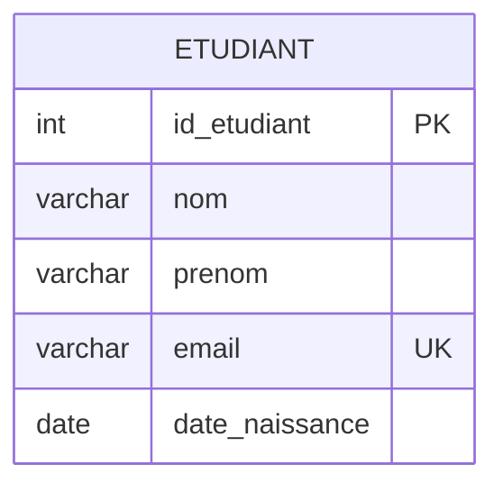
````

Résultat :


**Règles d'écriture :**
- On commence toujours par le mot `erDiagram`.
- Nom de l'entité en **MAJUSCULES**, sans accent ni espace (utiliser `_`) : `CARTE_ETUDIANT`.
- Chaque attribut s'écrit : `type nom [clé]`.
- Les clés possibles : `PK` (clé primaire), `FK` (clé étrangère), `UK` (unique).

### 3.2 Deux entités reliées

```text
ENTITE_A  <symbole_gauche>--<symbole_droite>  ENTITE_B : "verbe"
```

````markdown
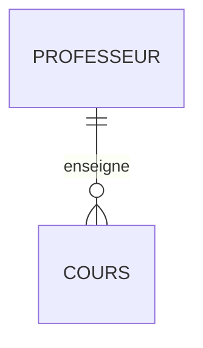
````


---

## 4. Les cardinalités : les 4 symboles à connaître

La **cardinalité** répond à la question : **« combien ? »**
Chaque symbole est fait de **2 informations** : le **minimum** et le **maximum**.

| Pièce du symbole | Signification |
|---|---|
| `o` (un rond) | **zéro** → c'est **facultatif** |
| `\|` (une barre) | **un** |
| `{` ou `}` (patte de corbeau 🐦) | **plusieurs** |

En combinant, on obtient **4 symboles** :

| Côté gauche | Côté droit | Minimum | Maximum | Se lit | Notation Merise |
|---|---|---|---|---|---|
| `\|o` | `o\|` | 0 | 1 | **zéro ou un** | 0,1 |
| `\|\|` | `\|\|` | 1 | 1 | **exactement un** | 1,1 |
| `}o` | `o{` | 0 | plusieurs | **zéro ou plusieurs** | 0,N |
| `}\|` | `\|{` | 1 | plusieurs | **un ou plusieurs** | 1,N |

> 🧠 **Astuce mémoire :**
> - Le symbole le plus **près de l'entité** = le **maximum**.
> - Le symbole le plus **près du trait** = le **minimum**.
> - Le côté gauche est simplement l'image **miroir** du côté droit (`o{` ↔ `}o`).

---

## 5. Comment lire une relation (la méthode)

Une relation se lit **toujours dans les deux sens**. Le symbole que l'on lit est celui **collé à l'entité d'arrivée**.

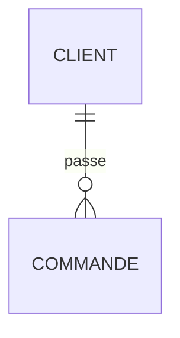

**Sens 1 : de gauche à droite (CLIENT → COMMANDE)**
On regarde le symbole **à côté de COMMANDE** : `o{` = zéro ou plusieurs.
> « Un client passe **zéro ou plusieurs** commandes. »

**Sens 2 : de droite à gauche (COMMANDE → CLIENT)**
On regarde le symbole **à côté de CLIENT** : `||` = exactement un.
> « Une commande est passée par **exactement un** client. »

### La phrase modèle à utiliser

> « **Un(e)** [entité de départ] [verbe] **[symbole collé à l'entité d'arrivée]** [entité d'arrivée]. »

Et on obtient le type de relation en regardant **les deux maximums** :

| Maximum côté A | Maximum côté B | Type |
|---|---|---|
| 1 | 1 | **1–1** |
| 1 | plusieurs | **1–N** |
| plusieurs | plusieurs | **N–N** |

---

## 6. Cas 1 : relation 1–1 (un à un)

Chaque élément de A est lié à **au maximum un** élément de B, et inversement.
Relation assez **rare** (souvent on fusionne les deux entités en une seule).

### Exemple 1.a : 1–1 obligatoire des deux côtés

> Un étudiant possède **exactement une** carte étudiante. Une carte appartient à **exactement un** étudiant.

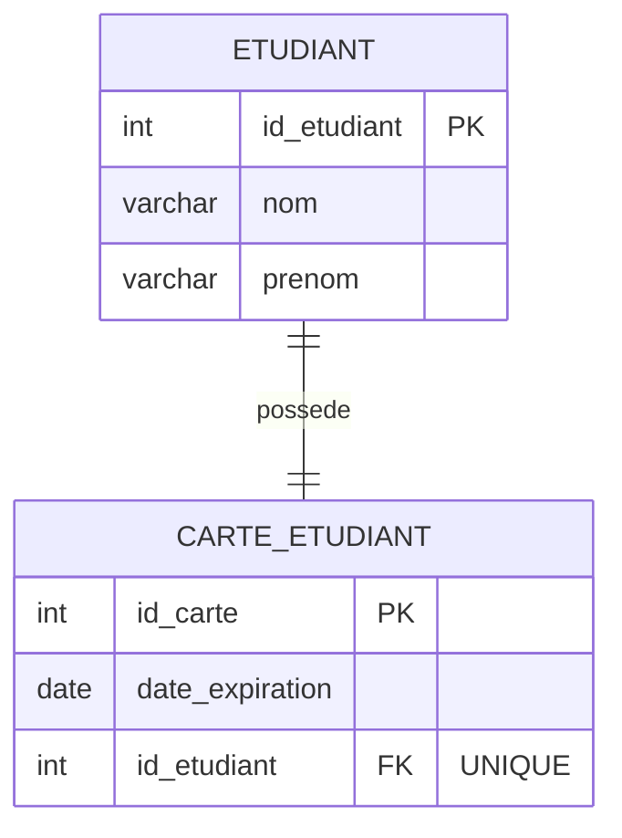

| Sens | Lecture |
|---|---|
| ETUDIANT → CARTE | Un étudiant possède **exactement une** carte. |
| CARTE → ETUDIANT | Une carte appartient à **exactement un** étudiant. |

### Exemple 1.b : 1–1 avec un côté facultatif

> Une personne possède **zéro ou un** passeport. Un passeport appartient à **exactement une** personne.

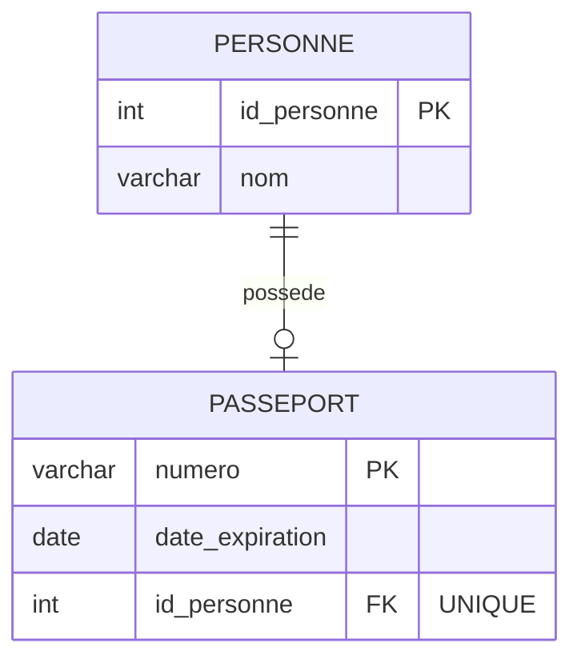

| Sens | Lecture |
|---|---|
| PERSONNE → PASSEPORT | Une personne possède **zéro ou un** passeport (`o|`). |
| PASSEPORT → PERSONNE | Un passeport appartient à **exactement une** personne (`||`). |

### Exemple 1.c : un pays a une capitale

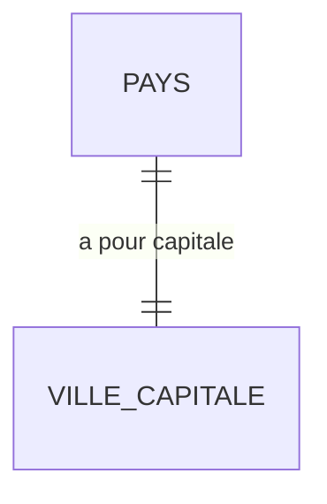

### En SQL
La clé étrangère se met d'un côté (de préférence le côté **facultatif**) et on ajoute **`UNIQUE`** pour empêcher d'avoir 2 passeports pour la même personne :

```sql
CREATE TABLE Personne (
    id_personne INT PRIMARY KEY,
    nom         VARCHAR(100) NOT NULL
);

CREATE TABLE Passeport (
    numero          VARCHAR(20) PRIMARY KEY,
    date_expiration DATE,
    id_personne     INT NOT NULL UNIQUE,         -- UNIQUE = "1 seul passeport par personne"
    FOREIGN KEY (id_personne) REFERENCES Personne(id_personne)
);
```

---

## 7. Cas 2 : relation 1–N (un à plusieurs)

C'est la relation **la plus fréquente**.
Un élément de A est lié à **plusieurs** éléments de B, mais chaque élément de B est lié à **un seul** élément de A.

### Exemple 2.a : professeur et cours (0 ou plusieurs)

> Un professeur enseigne **zéro ou plusieurs** cours (un nouveau prof peut n'avoir aucun cours). Un cours est enseigné par **exactement un** professeur.

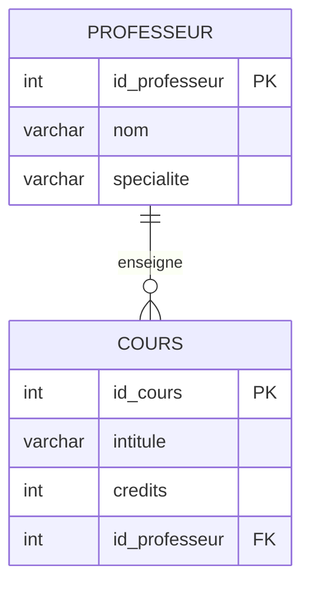

| Sens | Lecture |
|---|---|
| PROFESSEUR → COURS | Un professeur enseigne **zéro ou plusieurs** cours (`o{`). |
| COURS → PROFESSEUR | Un cours est enseigné par **exactement un** professeur (`||`). |

### Exemple 2.b : commande et lignes (1 ou plusieurs)

> Une commande contient **au moins une** ligne (une commande vide n'a pas de sens). Une ligne appartient à **exactement une** commande.

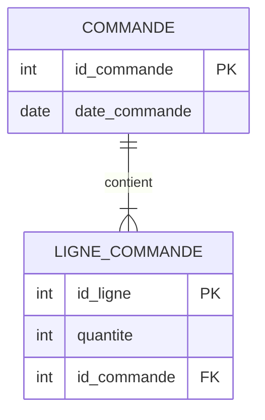

### Exemple 2.c : 1–N avec un côté facultatif

> Un employé travaille dans **zéro ou un** département (un stagiaire peut ne pas être affecté). Un département a **zéro ou plusieurs** employés.

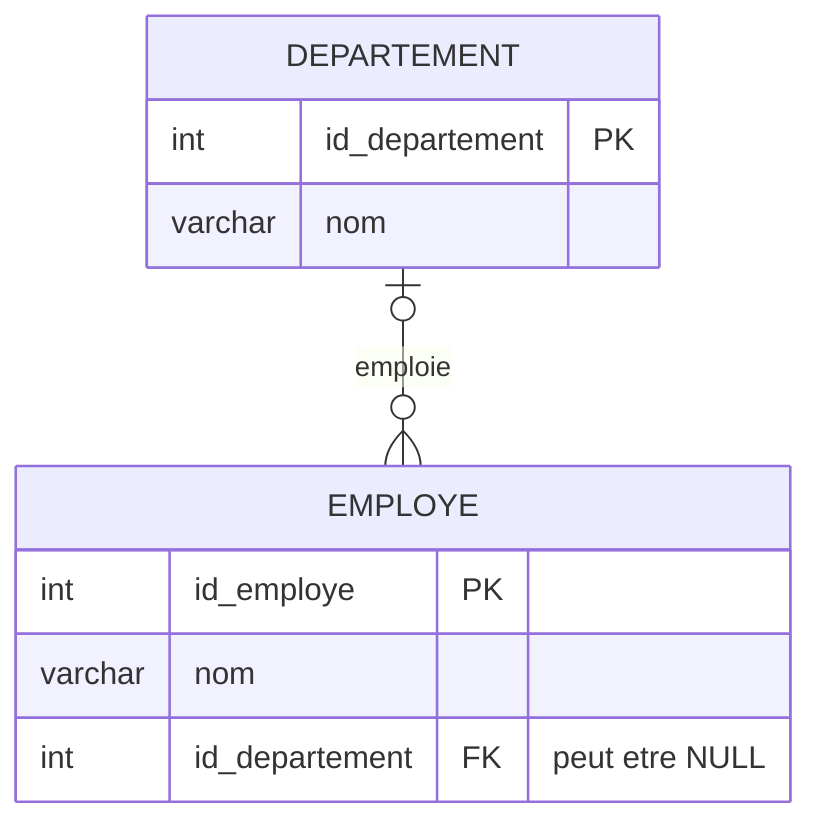

### Autres exemples de la vie courante (1–N)

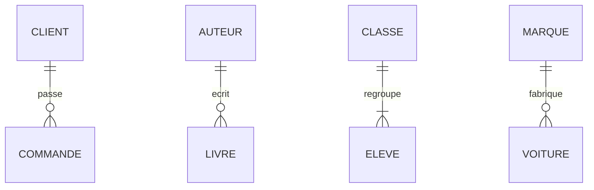

### En SQL
🔑 **Règle d'or : la clé étrangère va TOUJOURS du côté « plusieurs » (N).**

```sql
CREATE TABLE Professeur (
    id_professeur INT PRIMARY KEY,
    nom           VARCHAR(100) NOT NULL
);

CREATE TABLE Cours (
    id_cours      INT PRIMARY KEY,
    intitule      VARCHAR(100) NOT NULL,
    id_professeur INT NOT NULL,        -- NOT NULL car "exactement un" professeur
    FOREIGN KEY (id_professeur) REFERENCES Professeur(id_professeur)
);
```

> ❓ **Pourquoi pas l'inverse ?** Si on mettait `id_cours` dans Professeur, un prof ne pourrait avoir qu'**un seul** cours (une case = une valeur).

> 💡 Le minimum se traduit ainsi : `||` (exactement un) → **`NOT NULL`** · `|o` (zéro ou un) → la FK **peut être `NULL`**.

---

## 8. Cas 3 : relation N–N (plusieurs à plusieurs)

Un élément de A est lié à **plusieurs** éléments de B **et** un élément de B est lié à **plusieurs** éléments de A.

### Étape 1 : le diagramme « conceptuel »

> Un étudiant suit **plusieurs** cours. Un cours est suivi par **plusieurs** étudiants.

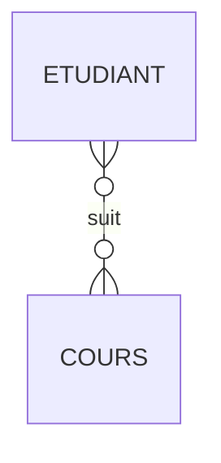

### ⚠️ Problème
En SQL, **impossible** de mettre la clé étrangère d'un côté :
- `id_cours` dans ETUDIANT → un étudiant n'aurait qu'un seul cours ❌
- `id_etudiant` dans COURS → un cours n'aurait qu'un seul étudiant ❌

### Étape 2 : la solution, une **table d'association**
On **casse** la relation N–N en **deux relations 1–N** grâce à une table au milieu.

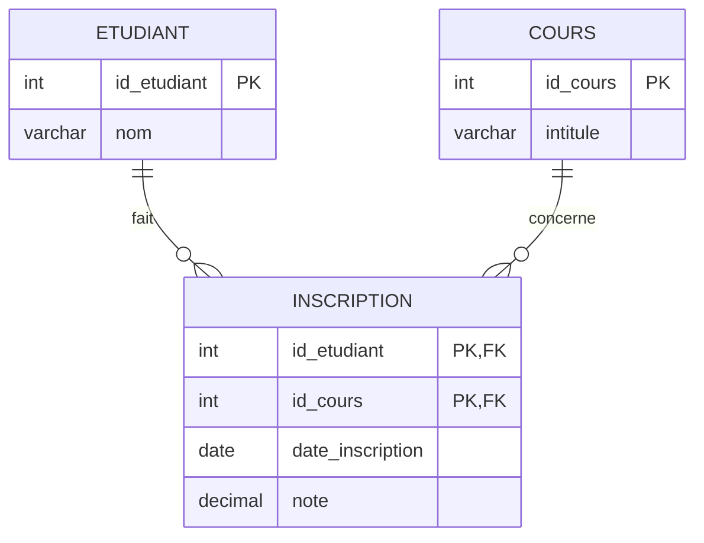

| Sens | Lecture |
|---|---|
| ETUDIANT → INSCRIPTION | Un étudiant fait **zéro ou plusieurs** inscriptions. |
| INSCRIPTION → ETUDIANT | Une inscription concerne **exactement un** étudiant. |
| COURS → INSCRIPTION | Un cours a **zéro ou plusieurs** inscriptions. |
| INSCRIPTION → COURS | Une inscription concerne **exactement un** cours. |

> 💡 La table d'association peut porter **ses propres attributs** : `date_inscription`, `note`… (la note n'appartient ni à l'étudiant seul, ni au cours seul, mais au **couple** étudiant-cours).

**Données d'exemple :**

| id_etudiant | id_cours | date_inscription | note |
|---|---|---|---|
| 1 | 10 | 2025-09-15 | 14.5 |
| 1 | 20 | 2025-09-15 | 12.0 |
| 2 | 10 | 2025-09-16 | 16.0 |

➡️ L'étudiant 1 suit 2 cours ; le cours 10 a 2 étudiants. ✅

### Autres exemples N–N

**Commande ↔ Produit** (table d'association `LIGNE_COMMANDE` avec la quantité) :

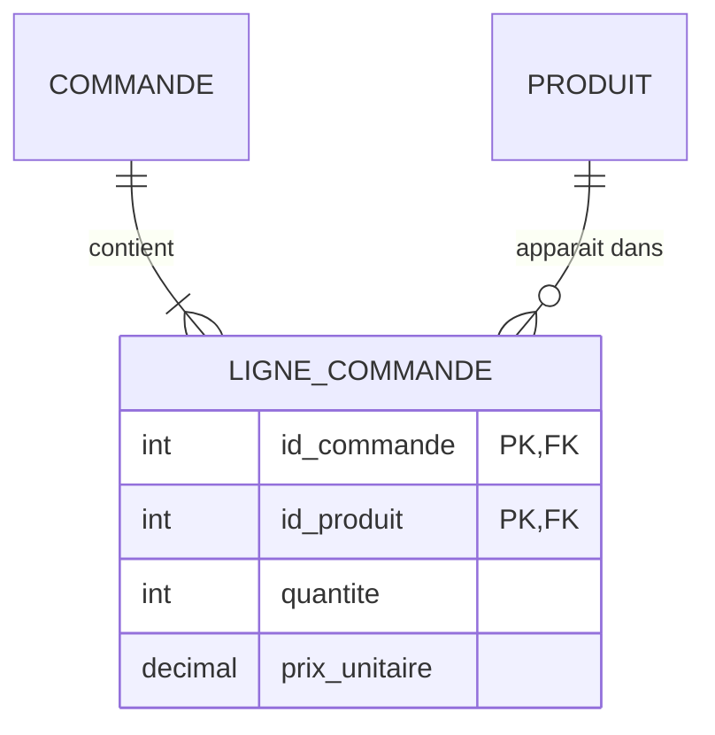

**Acteur ↔ Film** (table d'association `JOUE` avec le rôle) :

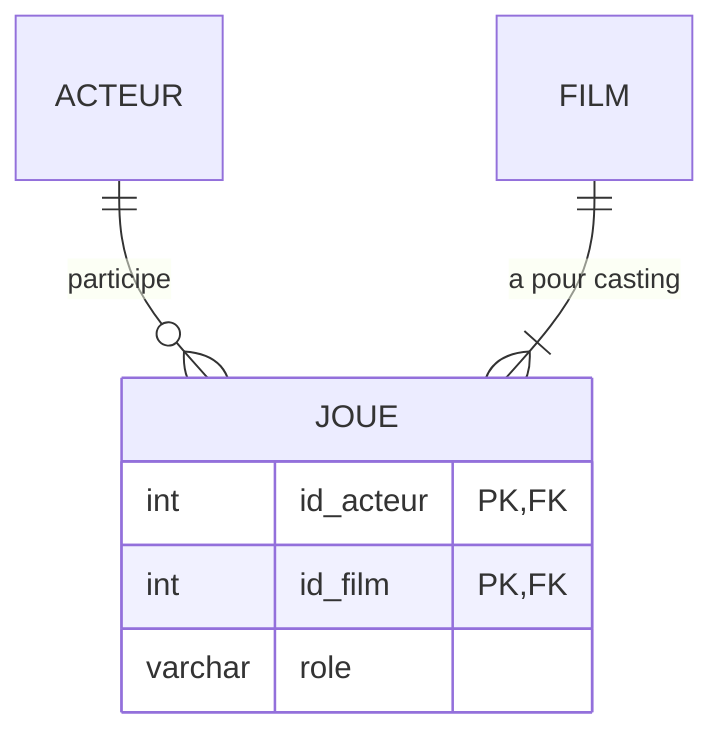

### En SQL

```sql
CREATE TABLE Etudiant (
    id_etudiant INT PRIMARY KEY,
    nom         VARCHAR(100) NOT NULL
);

CREATE TABLE Cours (
    id_cours INT PRIMARY KEY,
    intitule VARCHAR(100) NOT NULL
);

CREATE TABLE Inscription (
    id_etudiant      INT,
    id_cours         INT,
    date_inscription DATE DEFAULT CURRENT_DATE,
    note             DECIMAL(4,2),
    PRIMARY KEY (id_etudiant, id_cours),               -- clé composite : pas 2 fois la même inscription
    FOREIGN KEY (id_etudiant) REFERENCES Etudiant(id_etudiant),
    FOREIGN KEY (id_cours)    REFERENCES Cours(id_cours)
);
```

---

## 9. Cas 4 : relation réflexive

Une entité est liée **à elle-même**.

### Exemple 4.a : employé et chef (1–N réflexive)

> Un employé dirige **zéro ou plusieurs** employés. Un employé a **zéro ou un** chef (le directeur général n'a pas de chef).

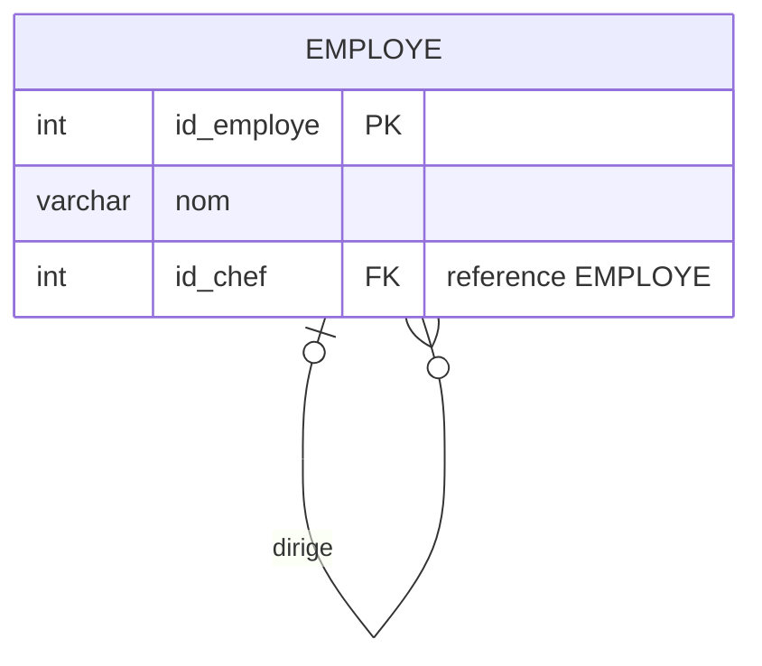

**Données d'exemple :**

| id_employe | nom | id_chef |
|---|---|---|
| 1 | Karim (directeur) | NULL |
| 2 | Sara | 1 |
| 3 | Ali | 1 |
| 4 | Omar | 2 |

➡️ Karim dirige Sara et Ali ; Sara dirige Omar.

```sql
CREATE TABLE Employe (
    id_employe INT PRIMARY KEY,
    nom        VARCHAR(100) NOT NULL,
    id_chef    INT,                                   -- NULL pour le directeur
    FOREIGN KEY (id_chef) REFERENCES Employe(id_employe)
);
```

### Exemple 4.b : un cours prérequis d'un autre (N–N réflexive)

> Un cours peut avoir plusieurs prérequis, et être le prérequis de plusieurs cours.

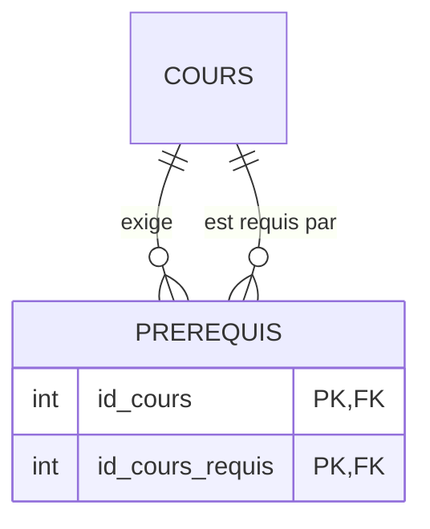

---

## 10. Cas 5 : plusieurs relations entre les mêmes entités

Deux entités peuvent être liées **par plusieurs relations différentes**. On crée alors **une clé étrangère par relation**.

> Un vol **part** d'un aéroport et **arrive** dans un aéroport.

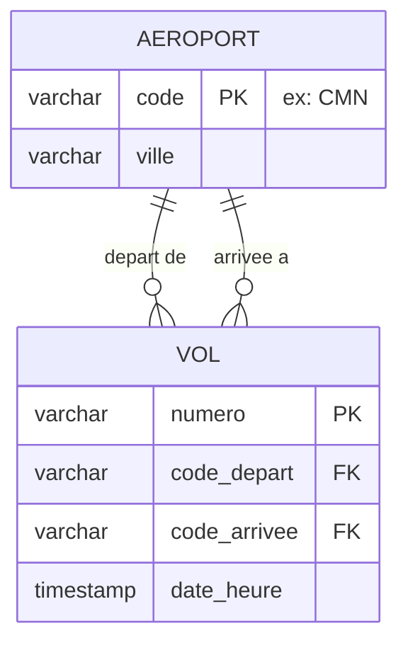

```sql
CREATE TABLE Vol (
    numero       VARCHAR(10) PRIMARY KEY,
    code_depart  VARCHAR(3) NOT NULL REFERENCES Aeroport(code),
    code_arrivee VARCHAR(3) NOT NULL REFERENCES Aeroport(code),
    date_heure   TIMESTAMP
);
```

---

## 11. Trait plein `--` ou pointillé `..` ?

Mermaid propose deux types de trait :

| Trait | Nom | Signification | Exemple |
|---|---|---|---|
| `--` (plein) | Relation **identifiante** | L'enfant **ne peut pas exister** sans le parent ; la FK fait partie de sa clé primaire | Une ligne de commande n'existe pas sans sa commande |
| `..` (pointillé) | Relation **non identifiante** | L'enfant a sa **propre** clé primaire, indépendante | Un cours a son propre `id_cours`, même s'il est lié à un prof |

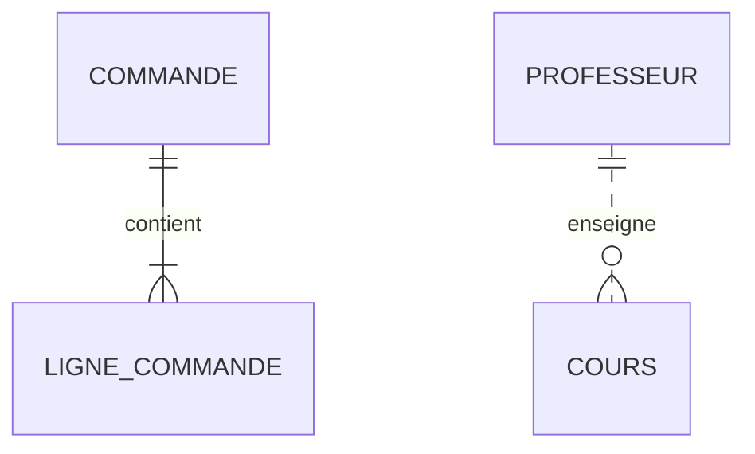

> 🎓 **Au début**, vous pouvez utiliser `--` partout : l'essentiel est de bien placer les **cardinalités**.

---

## 12. Méthode pas à pas pour construire un diagramme

Prenons cet énoncé :

> *« Une bibliothèque veut gérer ses livres et ses adhérents. Chaque livre a un titre, un ISBN et une année. Un livre est écrit par un ou plusieurs auteurs ; un auteur peut écrire plusieurs livres. Un adhérent peut emprunter plusieurs livres ; un livre peut être emprunté plusieurs fois (à des dates différentes). On note la date d'emprunt et la date de retour. Chaque livre appartient à une seule catégorie. »*

### Étape 1 : repérer les entités (les noms importants)
➡️ **LIVRE**, **AUTEUR**, **ADHERENT**, **CATEGORIE**

### Étape 2 : lister les attributs et choisir l'identifiant
| Entité | Attributs |
|---|---|
| LIVRE | **isbn** (PK), titre, annee |
| AUTEUR | **id_auteur** (PK), nom |
| ADHERENT | **id_adherent** (PK), nom, email |
| CATEGORIE | **id_categorie** (PK), libelle |

### Étape 3 : repérer les relations (les verbes)
- AUTEUR **écrit** LIVRE
- ADHERENT **emprunte** LIVRE
- LIVRE **appartient à** CATEGORIE

### Étape 4 : poser les 2 questions « combien ? » pour chaque relation

| Relation | Question 1 | Question 2 | Type |
|---|---|---|---|
| écrit | Un auteur écrit combien de livres ? **1 ou plusieurs** | Un livre est écrit par combien d'auteurs ? **1 ou plusieurs** | **N–N** |
| emprunte | Un adhérent emprunte combien de livres ? **0 ou plusieurs** | Un livre est emprunté combien de fois ? **0 ou plusieurs** | **N–N** |
| appartient | Une catégorie contient combien de livres ? **0 ou plusieurs** | Un livre appartient à combien de catégories ? **exactement 1** | **1–N** |

### Étape 5 : transformer les N–N en tables d'association
- écrit → **ECRIT** (id_auteur, isbn)
- emprunte → **EMPRUNT** (id_emprunt, id_adherent, isbn, date_emprunt, date_retour)

### Étape 6 : dessiner

```mermaid
erDiagram
    CATEGORIE ||--o{ LIVRE : "classe"
    AUTEUR ||--|{ ECRIT : "redige"
    LIVRE ||--|{ ECRIT : "est ecrit par"
    ADHERENT ||--o{ EMPRUNT : "effectue"
    LIVRE ||--o{ EMPRUNT : "concerne"

    CATEGORIE {
        int id_categorie PK
        varchar libelle
    }
    LIVRE {
        varchar isbn PK
        varchar titre
        int annee
        int id_categorie FK
    }
    AUTEUR {
        int id_auteur PK
        varchar nom
    }
    ECRIT {
        int id_auteur PK, FK
        varchar isbn PK, FK
    }
    ADHERENT {
        int id_adherent PK
        varchar nom
        varchar email UK
    }
    EMPRUNT {
        int id_emprunt PK
        int id_adherent FK
        varchar isbn FK
        date date_emprunt
        date date_retour
    }
```

> 💡 Pourquoi `EMPRUNT` a son propre `id_emprunt` ? Parce que le **même adhérent** peut emprunter le **même livre plusieurs fois** : le couple (id_adherent, isbn) ne suffit pas à identifier un emprunt.

---

## 13. Exemples complets

### 13.1 Université (schéma de la partie 1 du cours)

```mermaid
erDiagram
    DEPARTEMENT ||--o{ PROFESSEUR : "regroupe"
    PROFESSEUR ||--o{ COURS : "enseigne"
    ETUDIANT ||--o{ INSCRIPTION : "fait"
    COURS ||--o{ INSCRIPTION : "recoit"
    ETUDIANT ||--o| CARTE_ETUDIANT : "possede"

    DEPARTEMENT {
        int id_departement PK
        varchar nom
    }
    PROFESSEUR {
        int id_professeur PK
        varchar nom
        int id_departement FK
    }
    COURS {
        int id_cours PK
        varchar intitule
        int credit
        int id_professeur FK
    }
    ETUDIANT {
        int id_etudiant PK
        varchar nom
        varchar prenom
        date date_naissance
    }
    INSCRIPTION {
        int id_inscription PK
        int id_etudiant FK
        int id_cours FK
        date date_inscription
    }
    CARTE_ETUDIANT {
        int id_carte PK
        date date_expiration
        int id_etudiant FK
    }
```

### 13.2 Magasin en ligne (e-commerce)

```mermaid
erDiagram
    CLIENT ||--o{ COMMANDE : "passe"
    COMMANDE ||--|{ LIGNE_COMMANDE : "contient"
    PRODUIT ||--o{ LIGNE_COMMANDE : "figure dans"
    CATEGORIE ||--o{ PRODUIT : "classe"
    COMMANDE ||--o| PAIEMENT : "est reglee par"

    CLIENT {
        int id PK
        varchar nom
        varchar email UK
        varchar ville
    }
    COMMANDE {
        int id PK
        date date_commande
        int client_id FK
    }
    LIGNE_COMMANDE {
        int commande_id PK, FK
        int produit_id PK, FK
        int quantite
    }
    PRODUIT {
        int id PK
        varchar nom
        decimal prix
        int categorie_id FK
    }
    CATEGORIE {
        int id PK
        varchar libelle
    }
    PAIEMENT {
        int id PK
        decimal montant
        varchar mode
        int commande_id FK "UNIQUE"
    }
```

**Lecture de quelques relations :**
- Un client passe **zéro ou plusieurs** commandes ; une commande est passée par **exactement un** client.
- Une commande contient **au moins une** ligne.
- Une commande est réglée par **zéro ou un** paiement (pas encore payée = 0).

### 13.3 Hôpital

```mermaid
erDiagram
    SERVICE ||--|{ MEDECIN : "emploie"
    MEDECIN ||--o{ CONSULTATION : "realise"
    PATIENT ||--o{ CONSULTATION : "recoit"
    CONSULTATION ||--o| ORDONNANCE : "donne lieu a"
    ORDONNANCE ||--|{ PRESCRIPTION : "contient"
    MEDICAMENT ||--o{ PRESCRIPTION : "est prescrit dans"

    SERVICE {
        int id_service PK
        varchar nom
    }
    MEDECIN {
        int id_medecin PK
        varchar nom
        int id_service FK
    }
    PATIENT {
        int id_patient PK
        varchar nom
        date date_naissance
    }
    CONSULTATION {
        int id_consultation PK
        timestamp date_heure
        int id_medecin FK
        int id_patient FK
    }
    ORDONNANCE {
        int id_ordonnance PK
        int id_consultation FK
    }
    PRESCRIPTION {
        int id_ordonnance PK, FK
        int id_medicament PK, FK
        varchar posologie
    }
    MEDICAMENT {
        int id_medicament PK
        varchar nom
    }
```

---

## 14. Du diagramme ER aux tables SQL : les règles

| Élément du diagramme | Devient en SQL |
|---|---|
| Entité | Une **table** |
| Attribut | Une **colonne** |
| Identifiant | `PRIMARY KEY` |
| Relation **1–1** | FK d'un côté (côté facultatif) + **`UNIQUE`** |
| Relation **1–N** | FK **du côté N** (« plusieurs ») |
| Relation **N–N** | **Nouvelle table** d'association avec 2 FK (souvent PK composite) |
| Relation **réflexive** | FK dans la table qui pointe vers **sa propre** PK |
| Minimum = 1 (`\|\|`) côté parent | FK **`NOT NULL`** |
| Minimum = 0 (`\|o`) côté parent | FK **peut être `NULL`** |

### Aide-mémoire visuel

```mermaid
erDiagram
    A1 ||--|| B1 : "1-1 : FK + UNIQUE"
    A2 ||--o{ B2 : "1-N : FK cote B2"
    A3 }o--o{ B3 : "N-N : table au milieu"
```

---

## 15. Erreurs fréquentes

| ❌ Erreur | ✅ Correction |
|---|---|
| Mettre la FK du côté « 1 » dans une relation 1–N | La FK va **toujours du côté N** |
| Garder une relation N–N telle quelle en SQL | Créer une **table d'association** |
| Lire le symbole du mauvais côté | On lit le symbole **collé à l'entité d'arrivée** |
| Oublier le sens inverse | Toujours faire **2 phrases** par relation |
| Mettre des accents ou espaces dans les noms Mermaid | `CARTE_ETUDIANT`, pas `Carte étudiant` |
| Stocker une liste dans une colonne (`cours = "Java, SQL"`) | C'est le signe d'une relation 1–N ou N–N à modéliser |
| Mettre un attribut du couple dans une entité (la note dans ETUDIANT) | Le mettre dans la **table d'association** |

---

## 16. Exercices corrigés

### Exercice 1 : lire un diagramme
Écrivez les deux phrases de lecture :

```mermaid
erDiagram
    MEDECIN ||--o{ PATIENT : "suit"
```

<details>
<summary>✅ Corrigé</summary>

- Un médecin suit **zéro ou plusieurs** patients.
- Un patient est suivi par **exactement un** médecin.
- Type : **1–N** → la FK `id_medecin` va dans la table PATIENT.
</details>

---

### Exercice 2 : trouver la cardinalité
Pour chaque cas, donnez le type (1–1, 1–N, N–N) et le code Mermaid :
1. Un pays a une capitale ; une capitale appartient à un pays.
2. Une équipe a plusieurs joueurs ; un joueur joue dans une seule équipe.
3. Un élève pratique plusieurs sports ; un sport est pratiqué par plusieurs élèves.
4. Un utilisateur a zéro ou un profil ; un profil appartient à un utilisateur.

<details>
<summary>✅ Corrigé</summary>

```mermaid
erDiagram
    PAYS ||--|| CAPITALE : "a pour"
    EQUIPE ||--|{ JOUEUR : "compte"
    ELEVE }o--o{ SPORT : "pratique"
    UTILISATEUR ||--o| PROFIL : "possede"
```

1. **1–1** 2. **1–N** (FK `id_equipe` dans JOUEUR) 3. **N–N** (table `PRATIQUE`) 4. **1–1** (FK `id_utilisateur UNIQUE` dans PROFIL)
</details>

---

### Exercice 3 : résoudre une relation N–N
Transformez ce diagramme pour qu'il soit traduisible en SQL. On veut aussi garder **la date** de chaque participation.

```mermaid
erDiagram
    ETUDIANT }o--o{ CLUB : "adhere"
```

<details>
<summary>✅ Corrigé</summary>

```mermaid
erDiagram
    ETUDIANT ||--o{ ADHESION : "fait"
    CLUB ||--o{ ADHESION : "recoit"
    ETUDIANT {
        int id_etudiant PK
        varchar nom
    }
    CLUB {
        int id_club PK
        varchar nom
    }
    ADHESION {
        int id_etudiant PK, FK
        int id_club PK, FK
        date date_adhesion
    }
```

```sql
CREATE TABLE Adhesion (
    id_etudiant   INT REFERENCES Etudiant(id_etudiant),
    id_club       INT REFERENCES Club(id_club),
    date_adhesion DATE,
    PRIMARY KEY (id_etudiant, id_club)
);
```
</details>

---

### Exercice 4 : modéliser à partir d'un énoncé
> *« Une agence de location de voitures gère des clients, des voitures et des agences. Chaque voiture appartient à une seule agence. Une agence possède plusieurs voitures. Un client peut louer plusieurs voitures, et une voiture peut être louée plusieurs fois. Pour chaque location, on garde la date de début, la date de fin et le prix. »*

1. Trouvez les entités et leurs attributs.
2. Trouvez les relations et leurs cardinalités.
3. Dessinez le diagramme Mermaid.
4. Écrivez les `CREATE TABLE`.

<details>
<summary>✅ Corrigé</summary>

**Relations :**
- AGENCE → VOITURE : 1–N (une agence possède 0 ou plusieurs voitures ; une voiture est dans exactement 1 agence)
- CLIENT ↔ VOITURE : N–N → table **LOCATION** (avec son propre id, car un client peut louer la même voiture plusieurs fois)

```mermaid
erDiagram
    AGENCE ||--o{ VOITURE : "possede"
    CLIENT ||--o{ LOCATION : "effectue"
    VOITURE ||--o{ LOCATION : "fait l'objet de"

    AGENCE {
        int id_agence PK
        varchar ville
    }
    VOITURE {
        varchar immatriculation PK
        varchar marque
        varchar modele
        int id_agence FK
    }
    CLIENT {
        int id_client PK
        varchar nom
        varchar telephone
    }
    LOCATION {
        int id_location PK
        int id_client FK
        varchar immatriculation FK
        date date_debut
        date date_fin
        decimal prix
    }
```

```sql
CREATE TABLE Agence (
    id_agence INT PRIMARY KEY,
    ville     VARCHAR(50) NOT NULL
);

CREATE TABLE Voiture (
    immatriculation VARCHAR(15) PRIMARY KEY,
    marque          VARCHAR(50),
    modele          VARCHAR(50),
    id_agence       INT NOT NULL REFERENCES Agence(id_agence)
);

CREATE TABLE Client (
    id_client INT PRIMARY KEY,
    nom       VARCHAR(100) NOT NULL,
    telephone VARCHAR(20)
);

CREATE TABLE Location (
    id_location     INT PRIMARY KEY,
    id_client       INT NOT NULL REFERENCES Client(id_client),
    immatriculation VARCHAR(15) NOT NULL REFERENCES Voiture(immatriculation),
    date_debut      DATE NOT NULL,
    date_fin        DATE,
    prix            DECIMAL(10,2) CHECK (prix > 0),
    CHECK (date_fin >= date_debut)
);
```
</details>

---

## 🧠 À retenir en 5 points

1. **Entité** = nom commun → table ; **relation** = verbe → lien.
2. **4 symboles** : `||` exactement un · `o|` zéro ou un · `|{` un ou plusieurs · `o{` zéro ou plusieurs.
3. On lit le symbole **collé à l'entité d'arrivée**, et toujours **dans les 2 sens**.
4. **1–N** → la FK va du côté **N**.
5. **N–N** → on crée une **table d'association** au milieu.

---

<p align="center">
⬅️ <a href="01-modele-relationnel.md">Partie 1 : Modèle relationnel</a> · 🏠 <a href="README.md">Sommaire</a> · <a href="03-sql-fondamental.md">Partie 3 : SQL fondamental</a> ➡️
</p>
