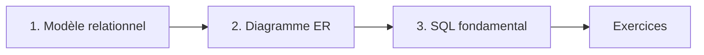

# 📚 Cours : Bases de données relationnelles & SQL

> Pr. BE. ELBAGHAZAOUI — ENSA BM

Un cours sur les bases de données relationnelles : du **modèle relationnel** à la **modélisation avec un diagramme ER**, puis au **langage SQL**.
Chaque notion est expliquée simplement et accompagnée d'**exemples**, de **résultats attendus** et d'**exercices corrigés**.

---

## 🗂️ Sommaire

| # | Chapitre | Contenu |
|---|---|---|
| 1 | [Introduction aux bases de données et modèle relationnel](01-modele-relationnel.md) | Base de données, SGBD, tables, attributs, tuples, clés primaires et étrangères, contraintes d'intégrité, relations 1-1 / 1-N / N-N |
| 2 | [Le diagramme Entité-Association (ER)](02-diagramme-er.md) | Entités, attributs, cardinalités, lecture d'un diagramme, cas 1-1 / 1-N / N-N / réflexif, passage au SQL, exemples en **Mermaid** |
| 3 | [SQL fondamental](03-sql-fondamental.md) | Types, DDL (`CREATE`, `ALTER`, `DROP`), contraintes, DML (`INSERT`, `UPDATE`, `DELETE`), `SELECT`, filtres, tris, agrégations, fonctions, jointures, transactions, index et vues |

---

## 🎯 Objectifs

À la fin de ce cours, vous saurez :

- ✅ expliquer ce qu'est une base de données relationnelle et un SGBD ;
- ✅ identifier les clés primaires, les clés étrangères et les types de relations ;
- ✅ lire et dessiner un diagramme ER ;
- ✅ transformer un diagramme ER en tables SQL ;
- ✅ créer, modifier et interroger une base de données avec SQL ;
- ✅ utiliser les jointures, les agrégations et les transactions.

---

## 🧭 Parcours conseillé



---

## 🛠️ Outils pour pratiquer

| Outil | Usage |
|---|---|
| [PostgreSQL](https://www.postgresql.org/download/) + [pgAdmin](https://www.pgadmin.org/) | SGBD utilisé dans les exemples |
| [DB Fiddle](https://www.db-fiddle.com/) | Tester des requêtes SQL en ligne, sans installation |
| [Mermaid Live Editor](https://mermaid.live/) | Dessiner et tester des diagrammes ER |

> 💡 Les diagrammes Mermaid s'affichent automatiquement sur GitHub.

---

## 📄 Structure du dépôt

```text
.
├── README.md                  ← vous êtes ici
├── 01-modele-relationnel.md
├── 02-diagramme-er.md
└── 03-sql-fondamental.md
```
